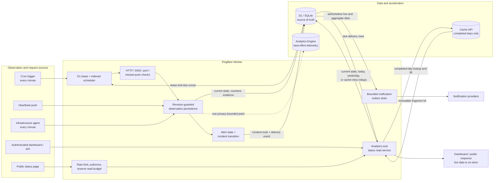

# Pingflare storage architecture

Pingflare separates authoritative operational state from high-volume telemetry and derived read acceleration.

## Ownership

| Concern | Cloudflare deployment | Docker deployment |
|---|---|---|
| Monitor configuration, current status, scheduler cursor | D1 | SQLite |
| Alert state, incidents, notification configuration and delivery outbox | D1 | SQLite |
| Exact current UTC-day counters | D1 `monitors` row | SQLite `monitors` row |
| Exact completed daily history | D1 `monitor_daily_rollups` | SQLite `monitor_daily_rollups` |
| High-resolution check and agent telemetry | Analytics Engine | Not exported; exact counters remain local |
| Transition/error evidence | Sparse D1 `status_logs` | Sparse SQLite `status_logs` |
| Completed historical aggregate cache | Cloudflare Cache API | Bounded process-local cache |

D1/SQLite is the source of truth. Analytics Engine writes are best-effort and never gate a check. Cache misses and failures fall back to D1.

## Current data flow



The telemetry and cache paths are deliberately non-authoritative. A failed Analytics Engine write is discarded, while a Cache API miss or error is served from D1/SQLite. No current state, recent logs, or active incidents are stored in Cache API.

## Check write path

1. A holder-owned 120-second D1 lease prevents scheduled and manual runs from overlapping. Long runs renew the lease before every external-check batch and again before persistence.
2. The scheduler selects due active monitors through the indexed `next_check_at` cursor. It hard-caps each run at eight and admits only work that fits the remaining 50-query Free-plan budget after fixed cron and notification-delivery reserves.
3. HTTP, DNS, and ping checks run in query-budgeted batches with concurrency up to six. Every check has one end-to-end deadline of at most 60 seconds, including response-body reads and digest-auth retries. Heartbeat and agent state is prefetched in one query.
4. A D1 batch archives a completed UTC day when needed and updates `last_checked_at`, `next_check_at`, and exact current-day counters in the same transaction. Compare-and-swap guards discard a cron heartbeat/agent result if a newer inbound push committed first.
5. Agent pushes also insert one CAS-guarded CPU/RAM/disk sample per five-minute bucket and an exact sample on health transitions. A trigger deletes at most one sample for that node older than 30 days after each insert.
6. A D1 diagnostic row is written only for first checks, status transitions, internal errors, or the ten-minute sample boundary.
7. One privacy-bounded Analytics Engine point is emitted synchronously. A write failure is ignored.
8. Alert handling runs after the scheduling cursor is durable. A steady healthy check uses one conditional alert-state reset so a successful check always breaks a failure streak. Transitions durably update monitor/incident truth and enqueue a deduplicated D1 delivery event; later observations repair an interrupted transition.
9. Each invocation drains at most two notification-provider attempts. Provider I/O has a cancellation-aware 12-second deadline; incomplete fan-out retries indefinitely with exponential backoff capped at one hour.

Monitor and incident transitions never depend on provider availability. Recovery closes the incident immediately while its notification remains retryable. Alert/reminder delivery state advances only after the snapshotted active channels complete; deleted or disabled channels are removed from pending fan-out.

## Read path

The `/api/monitors/:id/analytics` endpoint replaces four independent uptime requests. It reads:

- versioned completed daily rows older than yesterday from Cache API when present;
- yesterday and today directly from D1;
- the current monitor counter row directly from D1.

Full responses containing current status, logs, or incidents always return `Cache-Control: no-store`. Cache API stores only completed aggregate fragments, so a hit cannot make current status stale.

Cache keys include monitor IDs, per-monitor history revisions, and the requested range. Statistics reset and backup restore advance the revision. Cloudflare Cache API is data-center-local, so every region can fill independently without affecting correctness.

## Failure behavior

| Failure | Behavior |
|---|---|
| Analytics Engine unavailable at runtime | Monitoring and exact history continue in D1 |
| Analytics Engine not enabled for the account | Cloudflare rejects deployment before changing the active Worker; enable it once in the dashboard and redeploy |
| Cache API unavailable/miss | Query compact D1 rollups; use a bounded in-process fallback |
| Public status polling abuse | A pre-D1 visitor limiter plus a four-million-row UTC-day D1 reservation ledger protects the account-wide read quota |
| Duplicate cron/manual run | Second invocation exits when it cannot acquire the lease |
| Notification provider failure | Operational state still commits; the durable delivery row retries with capped backoff |
| Worker stops after a check | The renewable lease expires after 120 seconds; durable cursors prevent immediate duplicate scheduling once persistence completes |
| D1 migration failure | `npm run deploy` stops before deploying the new Worker |

## Capacity model

The scheduler's steady-state admission rate is the binding limit for scheduled HTTP, DNS, TCP-port, and missed-push checks:

```text
normal theoretical load:       sum(60 / monitor_interval_seconds) <= 2
conservative guaranteed load:  sum(60 / monitor_interval_seconds) <= 1
```

The normal bound applies after legacy catch-up and allows two healthy steady-state observations per minute. The conservative bound avoids backlog during a catch-up batch and preserves a slot under the worst transition query estimate. Due times should be distributed; admission rate does not guarantee that a large synchronized group completes in one cron invocation.

Healthy heartbeat and infrastructure-agent pushes use separate Worker requests and bypass external-check admission. A practical Cloudflare Free-plan starting point is up to ten healthy one-minute push sources, with D1 row writes and Worker requests monitored as real traffic is added. This is not a hard application maximum. When push sources stop, their missed-push checks return to the shared scheduler. A strict one-minute simultaneous-outage requirement must therefore count scheduled and push monitors together under the two-check/minute normal bound, or the one-check/minute conservative bound.

The supplied infrastructure agent reports once per minute. Ten-second reporting is unsupported: Cloudflare Cron cannot schedule below one minute, and a ten-second push source would consume 8,640 Worker requests and Analytics Engine points per day before D1 writes and UI/API traffic.

Historical infrastructure metrics deliberately use five-minute D1 samples
instead of every one-minute report. A composite primary key avoids a second
index, and per-insert retention removes at most one expired row without using a
cron query. Counting both the table row and primary-key entry, regular inserts
cost about 576 D1 row writes per agent/day; once 30-day retention starts, the
matching deletes bring the steady-state history budget to about 1,152
writes/agent/day. Ten agents add about 11,520 history writes/day plus rare
transition samples.

## Query and write controls

- Worker request-path schema DDL has been removed.
- Due selection is indexed and performed in SQL instead of loading every active monitor.
- Heartbeat rows are prefetched rather than queried once per monitor.
- Legacy minute-log reconciliation processes at most 25 rows every five minutes, persists a restart cursor, rescans for late writes before completion, and never pauses routine monitoring. Including table/index maintenance for the hourly retention batch, the conservative worst-case model stays below 50,000 D1 row writes/day and leaves roughly half the Free allowance for monitoring and delivery work.
- Daily uptime reads at most one compact row per monitor per day instead of scanning minute-level logs.
- Multi-monitor history and public-status reads pass ID sets through one JSON1 parameter instead of issuing one query per 90 IDs.
- Public status routes reuse already-loaded monitor rows, precompute shared date labels, cap pages at 180 monitors, and reserve conservative account-wide read units after page authorization but before expensive history work. Manual incident feeds drive from the selected monitor-link index; trigger-maintained per-monitor counts bound and pre-charge every candidate lookup.
- Password-protected status pages use the strong password hash only to issue a short-lived, slug-scoped HMAC token; polling verifies that token cheaply.
- Retention deletes at most 200 diagnostic rows per hour. Its next-run marker is persisted in D1, so backlog cleanup remains quota-bounded across Worker cold starts.
- Agent metric retention is independent and node-local: each new sample deletes at most one row for that node older than 30 days. It consumes no cron admission query.
- Destructive monitor/reset/restore paths estimate cascaded table and index writes and reject work above a 40,000-row safety envelope before changing data.
- Deployment applies the same 40,000-write envelope to the combined source rows of every missing index, pending obsolete-index build or cleanup, and migration backfill before issuing any schema mutation.
- Static frontend assets bypass Worker code; only `/api/*` and `/h/*` are Worker-first.
- Dashboard current state polls every 30 seconds, the Infrastructure view every 60 seconds, and historical uptime aggregates every five minutes; hidden tabs pause polling. Agent resource history is fetched on demand and does not poll.

The scheduler reserves eleven cron queries before admitting external work: nine for the normal fixed path and two for a batched alert-failure retry marker plus its fallback attempt. It also holds at least seven queries for the delivery drain. The drain upgrades from one to two provider attempts whenever the observed check path leaves the full 13-query allowance. The scheduler never performs a check whose result would have to be discarded for query-budget reasons. Deferred monitors remain due and are retried by the next cron invocation.

After legacy catch-up, the admission ceiling is two steady healthy checks per minute. On each five-minute catch-up batch, admission allows one healthy check, and a worst-case alert transition is still guaranteed one slot; intervening minutes regain the two-check allowance. The conservative steady estimate includes a hidden claimed-DOWN recovery repair, so that crash-recovery state cannot push an invocation past D1's 50-query limit.

Both public status route shapes call `PUBLIC_STATUS_RATE_LIMITER` before D1. The configured four-request/minute key combines visitor and slug and is local to a Cloudflare location. After the slug and password or monitor membership are validated, an atomic D1 UTC-day ledger reserves conservative read units against a four-million-row public allocation, preserving at least one million Free-plan reads for monitoring and authenticated operations. Nonexistent slugs and failed unlocks cannot consume that allocation. Frozen-day cache misses, selected-monitor incident candidates, incident fan-out, and at most 20 updates for each of 20 incidents reserve additional units before querying. Candidate feeds above 20,000 links fail explicitly without scanning; that permanent history-limit response is distinct from a daily budget reset. Summary and detail reads reuse their already-loaded monitor rows; shared UTC labels are computed once per response. Protected pages perform PBKDF2 only on unlock, then verify a ten-minute slug- and password-version-scoped HMAC access token for live polls.
